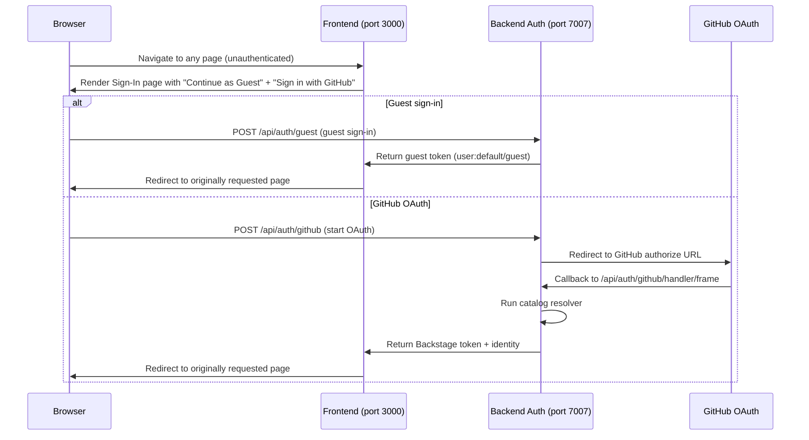

# Design Document: GitHub Auth

## Overview

Add GitHub OAuth as a second authentication provider alongside the existing guest provider in Backstage. The sign-in page will present two options: "Continue as Guest" (existing, zero-friction) and "Sign in with GitHub" (new, real identity). This is intentional for a DevOps Day demo — attendees can browse as guest, and the presenter can demonstrate GitHub login live.

The change touches four areas: backend module registration, `app-config.yaml` / `app-config.production.yaml`, the frontend sign-in page, and a catalog sign-in resolver that maps GitHub logins to Backstage User entities.

The implementation is intentionally minimal — no custom plugin, no new packages beyond what is already installed, and no changes to the permission or catalog pipelines beyond the resolver.

## Architecture



The backend uses Backstage's built-in `@backstage/plugin-auth-backend` + both `@backstage/plugin-auth-backend-module-guest-provider` and `@backstage/plugin-auth-backend-module-github-provider`. Both packages are already present in `packages/backend/package.json`. No new dependencies are required on the backend.

The frontend uses the new declarative system (`createApp` from `@backstage/frontend-defaults`). The sign-in page is wired via a `SignInPage` extension override — no legacy `createApp` APIs are used.

## Components and Interfaces

### Backend

| Component | Change |
|---|---|
| `packages/backend/src/index.ts` | Keep `plugin-auth-backend-module-guest-provider`, add `plugin-auth-backend-module-github-provider` |
| `app-config.yaml` | Keep `auth.providers.guest: {}`, add `auth.providers.github`, add `auth.environment: development` |
| `app-config.production.yaml` | Keep `auth.providers.guest: {}`, add `auth.providers.github`, set `auth.environment: production` |

The guest provider module is already registered and requires no changes. The GitHub provider module exposes the OAuth callback at `/api/auth/github/handler/frame` automatically — no custom route registration needed.

**Catalog Resolver** — configured via the `resolvers` option on the GitHub provider. The resolver uses `ctx.signInWithCatalogUser` to look up a User entity by the `github.com/user-login` annotation. If no entity is found it falls back to signing the user in under the `default` namespace using their GitHub login, which is appropriate for a demo environment.

### Frontend

| Component | Change |
|---|---|
| `packages/app/src/App.tsx` | Add `githubAuthApiRef` provider and `SignInPage` extension configured with both `guest` and `github` providers |

The new frontend system exposes sign-in configuration through an explicit `SignInPage` extension. The `@backstage/plugin-auth` package (already a transitive dep via `@backstage/frontend-defaults`) exports `githubAuthApiRef`, `guestProvider`, and the `SignInPage` component.

The sign-in page is configured with two providers: `guestProvider` ("Continue as Guest") and `githubAuthApiRef` ("Sign in with GitHub"). On successful auth the frontend stores the Backstage token and redirects to the originally requested route.

## Data Models

### app-config.yaml auth section (after change)

```yaml
auth:
  environment: development
  providers:
    guest: {}
    github:
      development:
        clientId: ${AUTH_GITHUB_CLIENT_ID}
        clientSecret: ${AUTH_GITHUB_CLIENT_SECRET}
```

### app-config.production.yaml auth section (after change)

```yaml
auth:
  environment: production
  providers:
    guest: {}
    github:
      production:
        clientId: ${AUTH_GITHUB_CLIENT_ID}
        clientSecret: ${AUTH_GITHUB_CLIENT_SECRET}
```

### Catalog User entity (existing, no change required)

The resolver matches against the annotation `github.com/user-login` on User entities already in the catalog (loaded from `examples/org.yaml`). No schema changes are needed.

```yaml
# example User entity that the resolver can match
apiVersion: backstage.io/v1alpha1
kind: User
metadata:
  name: octocat
  annotations:
    github.com/user-login: octocat   # resolver matches on this
spec:
  profile:
    email: octocat@github.com
```

### Resolver logic (pseudo-code)

```
async resolve(ctx):
  try:
    return await ctx.signInWithCatalogUser({
      annotations: { 'github.com/user-login': ctx.result.fullProfile.username }
    })
  catch EntityNotFoundError:
    return ctx.issueToken({
      claims: {
        sub: `user:default/${ctx.result.fullProfile.username}`,
        ent: [`user:default/${ctx.result.fullProfile.username}`]
      }
    })
```

## Correctness Properties

*A property is a characteristic or behavior that should hold true across all valid executions of a system — essentially, a formal statement about what the system should do. Properties serve as the bridge between human-readable specifications and machine-verifiable correctness guarantees.*

### Property 1: Missing GitHub credentials prevent backend startup

*For any* combination of absent `AUTH_GITHUB_CLIENT_ID` or `AUTH_GITHUB_CLIENT_SECRET` environment variables, the backend auth module SHALL fail to start and emit a descriptive error rather than starting with invalid configuration.

**Validates: Requirements 2.4**

### Property 2: Sign-in page renders both providers for all unauthenticated routes

*For any* route in the frontend app accessed without a valid Backstage token, the rendered page SHALL contain both a "Sign in with GitHub" button and a "Continue as Guest" option, and SHALL NOT render the main application content.

**Validates: Requirements 3.2, 3.3**

### Property 3: OAuth error surfaces to the user

*For any* error thrown by the GitHub OAuth flow (network failure, user cancellation, invalid credentials), the sign-in page SHALL display a non-empty error message and SHALL render a control that allows the user to retry.

**Validates: Requirements 3.7**

### Property 4: Catalog resolver round-trip for known users

*For any* GitHub login that corresponds to a User entity in the catalog (matched via `github.com/user-login` annotation), the resolver SHALL return an entity reference that, when looked up in the catalog, resolves to that same User entity.

**Validates: Requirements 4.1, 4.2**

### Property 5: Resolver fallback for unknown users

*For any* GitHub login that has no matching User entity in the catalog, the resolver SHALL return a token whose `sub` claim is `user:default/<github-login>` rather than throwing an error.

**Validates: Requirements 4.3**

## Error Handling

| Scenario | Behaviour |
|---|---|
| `AUTH_GITHUB_CLIENT_ID` / `AUTH_GITHUB_CLIENT_SECRET` missing at startup | Backend fails to start; Backstage config validation throws with a message naming the missing key |
| GitHub OAuth callback receives an error code | `plugin-auth-backend` returns a 401; frontend sign-in page catches and displays the error |
| User cancels the OAuth popup | `githubAuthApiRef.signIn()` rejects; sign-in page catches and shows a retry button |
| Catalog lookup throws unexpectedly | Resolver catches and falls back to the default-namespace token (permissive demo behaviour) |
| Guest sign-in fails | `plugin-auth-backend-module-guest-provider` returns an error; sign-in page displays the error |
| `GITHUB_TOKEN` (integration token) is unrelated to auth | No impact — the integration token is only used for catalog/scaffolder API calls, not for OAuth |

## Testing Strategy

### Unit / Example Tests

Focus on concrete, deterministic scenarios:

- Config structure: assert `app-config.yaml` contains both `auth.providers.guest` and `auth.providers.github`
- Backend registration: assert both the guest provider module and GitHub provider module are imported
- Resolver success path: mock `signInWithCatalogUser` returning a known entity ref, assert the resolver returns it
- Resolver fallback path: mock `signInWithCatalogUser` throwing `NotFoundError`, assert the resolver returns a `user:default/<login>` token
- Frontend sign-in page render: render with `@backstage/frontend-test-utils`, assert both the GitHub sign-in button and guest option are present when no token exists
- Production config: assert `app-config.production.yaml` contains `auth.environment: production`, `auth.providers.guest`, and `auth.providers.github`

### Property-Based Tests

Use **fast-check** (already a transitive dev dependency via Backstage test utilities) with a minimum of **100 iterations** per property.

Each test is tagged with a comment in the format:
`// Feature: github-auth, Property <N>: <property text>`

**Property 1 — Missing credentials prevent startup**
```
// Feature: github-auth, Property 1: Missing credentials prevent backend startup
fc.assert(fc.property(
  fc.subarray(['AUTH_GITHUB_CLIENT_ID', 'AUTH_GITHUB_CLIENT_SECRET'], { minLength: 1 }),
  (missingVars) => {
    // start backend with those vars unset, assert it throws a config error
  }
), { numRuns: 100 })
```

**Property 2 — Sign-in page renders both providers for all unauthenticated routes**
```
// Feature: github-auth, Property 2: Sign-in page renders both providers for all unauthenticated routes
fc.assert(fc.property(
  fc.webPath(),   // arbitrary frontend route
  async (route) => {
    // render app at route with no token, assert both GitHub button and guest option present
  }
), { numRuns: 100 })
```

**Property 3 — OAuth error surfaces to user**
```
// Feature: github-auth, Property 3: OAuth error surfaces to the user
fc.assert(fc.property(
  fc.oneof(fc.string(), fc.constant('NetworkError'), fc.constant('access_denied')),
  async (errorMessage) => {
    // mock githubAuthApiRef.signIn to throw with errorMessage
    // render sign-in page, click button, assert error text visible and retry button present
  }
), { numRuns: 100 })
```

**Property 4 — Catalog resolver round-trip**
```
// Feature: github-auth, Property 4: Catalog resolver round-trip for known users
fc.assert(fc.property(
  fc.record({ login: fc.string({ minLength: 1 }), entityRef: fc.string({ minLength: 1 }) }),
  async ({ login, entityRef }) => {
    // mock catalog with a User entity annotated with login
    // run resolver with that login, assert returned ref matches entityRef
  }
), { numRuns: 100 })
```

**Property 5 — Resolver fallback**
```
// Feature: github-auth, Property 5: Resolver fallback for unknown users
fc.assert(fc.property(
  fc.string({ minLength: 1 }),   // arbitrary github login
  async (login) => {
    // mock catalog returning NotFoundError for any lookup
    // run resolver, assert sub claim === `user:default/${login}`
  }
), { numRuns: 100 })
```
