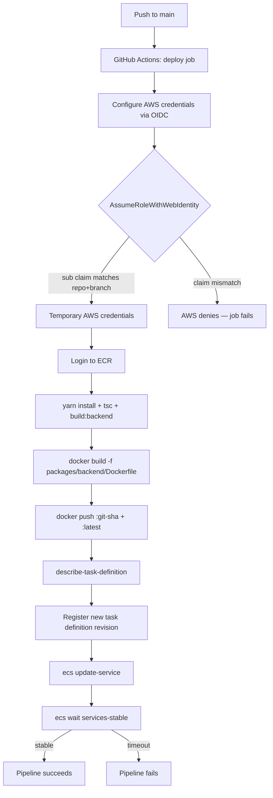
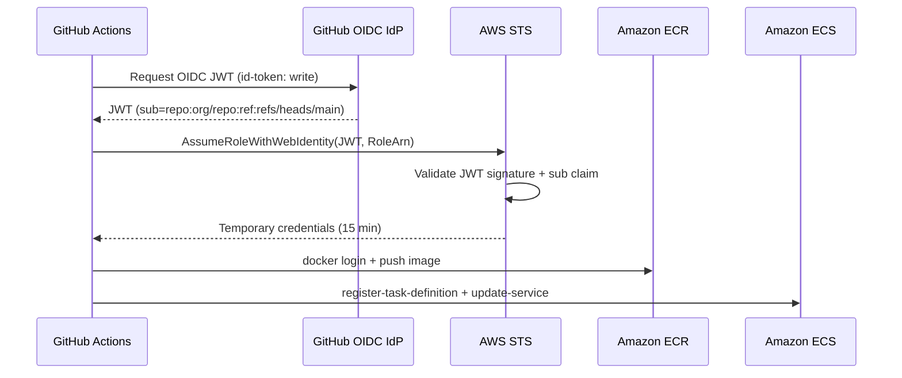

# Design Document: CI/CD Pipeline

## Overview

This feature implements a GitHub Actions pipeline that builds the Backstage backend Docker image and deploys it to AWS ECS Fargate on every push to `main`. AWS authentication uses OpenID Connect (OIDC) — GitHub Actions exchanges a short-lived JWT for temporary AWS credentials, eliminating long-lived secrets entirely. The supporting AWS IAM resources (OIDC provider + assume-role IAM role) are managed as a new Terraform module at `terraform/modules/oidc/`.

The pipeline is a single GitHub Actions workflow file (`.github/workflows/deploy.yml`) with one job containing sequential steps: authenticate → build → push → deploy. Image tags are the Git SHA of the triggering commit, ensuring every deployed image is uniquely traceable to a commit.

---

## Architecture

### Pipeline Flow



### OIDC Trust Flow



### Component Relationships

```
.github/workflows/deploy.yml          ← pipeline definition
terraform/modules/oidc/               ← OIDC provider + IAM role
  ├── main.tf
  ├── variables.tf
  └── outputs.tf
terraform/main.tf                     ← calls oidc module
backstage-portal/packages/backend/Dockerfile  ← image source
```

---

## Components and Interfaces

### GitHub Actions Workflow (`.github/workflows/deploy.yml`)

Single job `deploy` with the following steps in order:

| Step | Action / Command | Purpose |
|------|-----------------|---------|
| Checkout | `actions/checkout@<sha>` | Clone repo |
| Configure AWS credentials | `aws-actions/configure-aws-credentials@<sha>` | Exchange OIDC JWT for temp creds |
| Login to ECR | `aws-actions/amazon-ecr-login@<sha>` | Authenticate Docker to ECR |
| Set up Node.js | `actions/setup-node@<sha>` | Install Node 22 |
| Install dependencies | `yarn install --immutable` | Reproducible install |
| Type check | `yarn tsc` | Fail fast on type errors |
| Build backend | `yarn build:backend` | Produce `dist/` artifacts |
| Build Docker image | `docker build` | Build image with git SHA tag |
| Push Docker image | `docker push` (×2) | Push `:git-sha` and `:latest` |
| Describe task definition | `aws ecs describe-task-definition` | Get current task def JSON |
| Render new task definition | `jq` inline | Swap container image URI |
| Register task definition | `aws ecs register-task-definition` | Create new revision |
| Update ECS service | `aws ecs update-service` | Trigger rolling update |
| Wait for stability | `aws ecs wait services-stable` | Block until healthy |

**Workflow-level permissions** (job scope, not workflow scope):
```yaml
permissions:
  id-token: write   # required for OIDC JWT request
  contents: read    # required for checkout
```

**Environment inputs** (all from GitHub secrets):
- `AWS_ACCOUNT_ID` — used to construct ECR URI
- `AWS_REGION` — AWS region
- `ECR_REPOSITORY` — ECR repo name
- `ECS_CLUSTER` — ECS cluster name
- `ECS_SERVICE` — ECS service name
- `AWS_ROLE_ARN` — IAM role to assume via OIDC

**Derived values** (computed in workflow, not secrets):
- `IMAGE_TAG` = `${{ github.sha }}`
- `ECR_IMAGE` = `<AWS_ACCOUNT_ID>.dkr.ecr.<AWS_REGION>.amazonaws.com/<ECR_REPOSITORY>:<IMAGE_TAG>`

### Terraform OIDC Module (`terraform/modules/oidc/`)

Three files:

**`main.tf`** — defines:
- `aws_iam_openid_connect_provider.github` — registers GitHub's OIDC IdP with AWS
- `aws_iam_role.github_actions` — the role the pipeline assumes
- `aws_iam_role_policy.github_actions` — inline least-privilege policy

**`variables.tf`** — inputs:
- `github_repository` (string) — `"org/repo"` format, used to scope the `sub` claim
- `ecr_repository_arn` (string) — scopes ECR push permissions
- `ecs_cluster_arn` (string) — scopes ECS permissions
- `ecs_service_arn` (string) — scopes ECS permissions
- `ecs_execution_role_arn` (string) — scopes `iam:PassRole`
- `environment` / `project` — tagging

**`outputs.tf`** — exports:
- `role_arn` — the GitHub Actions role ARN (store as `AWS_ROLE_ARN` secret)

### Integration with Root Terraform (`terraform/main.tf`)

A new `module "oidc"` block calls `./modules/oidc`, passing ARNs from existing modules:
- `ecr_repository_arn` ← `module.ecr.repository_arn`
- `ecs_cluster_arn` ← `module.ecs.ecs_cluster_arn`
- `ecs_service_arn` ← `module.ecs.ecs_service_arn`
- `ecs_execution_role_arn` ← `module.ecs.execution_role_arn`

---

## Data Models

### IAM Trust Policy (GitHub Actions Role)

```json
{
  "Version": "2012-10-17",
  "Statement": [
    {
      "Effect": "Allow",
      "Principal": {
        "Federated": "arn:aws:iam::<ACCOUNT_ID>:oidc-provider/token.actions.githubusercontent.com"
      },
      "Action": "sts:AssumeRoleWithWebIdentity",
      "Condition": {
        "StringEquals": {
          "token.actions.githubusercontent.com:aud": "sts.amazonaws.com",
          "token.actions.githubusercontent.com:sub": "repo:<GITHUB_REPOSITORY>:ref:refs/heads/main"
        }
      }
    }
  ]
}
```

The `sub` condition pins trust to a specific repo AND the `main` branch. Any other branch, fork, or PR cannot assume this role.

### IAM Permissions Policy (GitHub Actions Role)

```json
{
  "Version": "2012-10-17",
  "Statement": [
    {
      "Sid": "ECRAuth",
      "Effect": "Allow",
      "Action": "ecr:GetAuthorizationToken",
      "Resource": "*"
    },
    {
      "Sid": "ECRPush",
      "Effect": "Allow",
      "Action": [
        "ecr:BatchCheckLayerAvailability",
        "ecr:GetDownloadUrlForLayer",
        "ecr:BatchGetImage",
        "ecr:InitiateLayerUpload",
        "ecr:UploadLayerPart",
        "ecr:CompleteLayerUpload",
        "ecr:PutImage"
      ],
      "Resource": "<ECR_REPOSITORY_ARN>"
    },
    {
      "Sid": "ECSRegisterTaskDef",
      "Effect": "Allow",
      "Action": "ecs:RegisterTaskDefinition",
      "Resource": "*"
    },
    {
      "Sid": "ECSDeployment",
      "Effect": "Allow",
      "Action": [
        "ecs:DescribeServices",
        "ecs:UpdateService",
        "ecs:DescribeTaskDefinition"
      ],
      "Resource": [
        "<ECS_CLUSTER_ARN>",
        "<ECS_SERVICE_ARN>"
      ]
    },
    {
      "Sid": "PassExecutionRole",
      "Effect": "Allow",
      "Action": "iam:PassRole",
      "Resource": "<ECS_TASK_EXECUTION_ROLE_ARN>"
    }
  ]
}
```

Note: `ecr:GetAuthorizationToken` requires `Resource: "*"` — this is an AWS API constraint, not a policy weakness. All other statements are scoped to specific ARNs.

### GitHub Actions Workflow Structure

```yaml
name: Deploy Backstage to ECS

on:
  push:
    branches: [main]

jobs:
  deploy:
    runs-on: ubuntu-latest
    permissions:
      id-token: write
      contents: read
    env:
      AWS_REGION: ${{ secrets.AWS_REGION }}
      ECR_REPOSITORY: ${{ secrets.ECR_REPOSITORY }}
      ECS_CLUSTER: ${{ secrets.ECS_CLUSTER }}
      ECS_SERVICE: ${{ secrets.ECS_SERVICE }}
      IMAGE_TAG: ${{ github.sha }}
    steps:
      # ... steps as described in Components section
```

### ECS Task Definition Update Model

The deploy step reads the current task definition, extracts the container definitions array, replaces the `image` field for the `backstage` container, strips AWS-managed fields (`taskDefinitionArn`, `revision`, `status`, `requiresAttributes`, `compatibilities`, `registeredAt`, `registeredBy`), then registers the cleaned JSON as a new revision.

```
current_task_def_json
  → jq: del(.taskDefinitionArn, .revision, .status, ...)
  → jq: .containerDefinitions[0].image = "<new_ecr_uri>"
  → aws ecs register-task-definition --cli-input-json
  → new_task_def_arn
  → aws ecs update-service --task-definition <new_task_def_arn>
```

---

## Correctness Properties

*A property is a characteristic or behavior that should hold true across all valid executions of a system — essentially, a formal statement about what the system should do. Properties serve as the bridge between human-readable specifications and machine-verifiable correctness guarantees.*

### Property 1: OIDC authentication excludes long-lived credentials

*For any* GitHub Actions workflow file that uses `aws-actions/configure-aws-credentials`, the step inputs must include `role-to-assume` and must not include `aws-access-key-id` or `aws-secret-access-key`.

**Validates: Requirements 1.1**

---

### Property 2: Trust policy restricts assumption to repo and main branch

*For any* `github_repository` input value (e.g. `"org/repo"`), the generated IAM trust policy's `sub` condition must equal exactly `"repo:<github_repository>:ref:refs/heads/main"` and the action must be `"sts:AssumeRoleWithWebIdentity"` — no other actions or subjects are permitted.

**Validates: Requirements 1.4, 1.5**

---

### Property 3: Permissions policy contains no wildcard actions

*For any* generated IAM permissions policy, no statement may have `Action: "*"` or `Action: ["*"]`. Every action must be explicitly named.

**Validates: Requirements 2.6**

---

### Property 4: Permissions policy scopes all non-global actions to specific ARNs

*For any* set of ARN inputs (`ecr_repository_arn`, `ecs_cluster_arn`, `ecs_service_arn`, `ecs_execution_role_arn`), the generated permissions policy must scope ECR push actions to `ecr_repository_arn`, ECS deployment actions to `ecs_cluster_arn` and `ecs_service_arn`, and `iam:PassRole` to `ecs_execution_role_arn`. No ARN-scoped action may use `"*"` as its resource.

**Validates: Requirements 2.2, 2.4, 2.5**

---

### Property 5: ECR image URI construction is correct for all inputs

*For any* combination of AWS account ID, region, ECR repository name, and image tag, the constructed ECR image URI must equal `<account_id>.dkr.ecr.<region>.amazonaws.com/<repository>:<tag>` with no extra characters, missing separators, or transposed components.

**Validates: Requirements 3.4**

---

### Property 6: Task definition image replacement preserves all other fields

*For any* ECS task definition JSON and any new ECR image URI, the jq transformation that replaces the container image must produce a document where: (a) the `backstage` container's `image` field equals the new URI, and (b) all other fields in the task definition are identical to the original (after stripping AWS-managed metadata fields).

**Validates: Requirements 6.2**

---

### Property 7: All third-party GitHub Actions are pinned to commit SHAs

*For any* `uses:` directive in the workflow file that references a third-party action (i.e. not a local `./` action), the version specifier must be a 40-character lowercase hexadecimal string (a full Git commit SHA), not a mutable tag like `v3` or `main`.

**Validates: Requirements 7.1**

---

## Error Handling

| Failure Point | Behavior | Recovery |
|--------------|----------|----------|
| OIDC JWT request fails | Job fails at credentials step; no AWS calls made | Fix repo/branch trust policy conditions |
| `AssumeRoleWithWebIdentity` denied | Job fails with AWS error; no resources modified | Verify `sub` claim matches trust policy |
| `yarn install` / `tsc` / `build:backend` fails | Job fails; Docker build never starts | Fix code errors, re-push |
| Docker build fails (non-zero exit) | Job fails; no image pushed | Fix Dockerfile or build context issues |
| ECR push fails | Job fails; ECS not updated | Check ECR permissions, network, repo existence |
| `register-task-definition` fails | Job fails; ECS service not updated | Check IAM permissions, task def JSON validity |
| `update-service` fails | Job fails; old task definition remains active | Check ECS service/cluster ARNs and permissions |
| `wait services-stable` times out | Job fails; deployment may be partially complete | Check ECS task logs in CloudWatch, roll back manually via console or re-push a fix |
| Required GitHub secret missing | Step that references the secret fails with empty-value error | Add the missing secret to GitHub repository settings |

**No rollback automation is implemented in this pipeline.** If a deployment fails after `update-service` succeeds, the operator must manually update the ECS service to the previous task definition revision. A future enhancement could add automatic rollback using the previous task definition ARN captured before the update.

---

## Testing Strategy

### Dual Testing Approach

Both unit/structural tests and property-based tests are required. They are complementary:
- Structural tests verify the workflow YAML and Terraform HCL are correctly formed
- Property-based tests verify universal correctness of the logic components

### Structural / Example Tests

These verify the static configuration files are correct. Implemented as unit tests using a YAML/JSON parser (e.g. Python `pytest` + `pyyaml`, or a shell-based `yq`/`jq` test suite):

- Workflow triggers only on `push` to `main` (Req 3.1)
- Workflow references all required secret names (Req 3.2)
- `IMAGE_TAG` is set from `github.sha` (Req 3.3)
- Build steps appear in correct order: install → tsc → build:backend → docker build (Req 4.1)
- `docker build` uses `-f backstage-portal/packages/backend/Dockerfile` with `backstage-portal/` context (Req 4.2)
- Image is tagged with both `$IMAGE_TAG` and `latest` (Req 4.3, 4.4)
- ECR login step precedes push steps (Req 5.1)
- Both `:$IMAGE_TAG` and `:latest` are pushed (Req 5.2, 5.3)
- `describe-task-definition`, `register-task-definition`, `update-service`, `wait services-stable` steps all present (Req 6.1, 6.3, 6.4, 6.5)
- Job `permissions` block contains exactly `id-token: write` and `contents: read` (Req 7.2)
- `runs-on: ubuntu-latest` (Req 7.4)
- Terraform module contains `aws_iam_openid_connect_provider` resource (Req 8.1)
- Terraform module contains `aws_iam_role` resource (Req 8.2)
- Terraform module contains `aws_iam_role_policy` or `aws_iam_policy` resource (Req 8.3)
- `variables.tf` declares `github_repository` variable (Req 8.4)
- `outputs.tf` exports `role_arn` (Req 8.5)
- `terraform plan` exits 0 against the module (Req 8.6)

### Property-Based Tests

Implemented using a property-based testing library appropriate to the test language (e.g. `hypothesis` for Python, `fast-check` for TypeScript). Each test runs a minimum of 100 iterations.

**Property 1: OIDC authentication excludes long-lived credentials**
- Generator: random valid workflow YAML structures with `configure-aws-credentials` step
- Assertion: `role-to-assume` present, `aws-access-key-id` and `aws-secret-access-key` absent
- Tag: `Feature: 03-ci-cd-pipeline, Property 1: OIDC authentication excludes long-lived credentials`

**Property 2: Trust policy restricts assumption to repo and main branch**
- Generator: random GitHub repository strings in `org/repo` format (random org names, random repo names)
- Assertion: generated trust policy `sub` condition equals `repo:<input>:ref:refs/heads/main`, action is `sts:AssumeRoleWithWebIdentity`
- Tag: `Feature: 03-ci-cd-pipeline, Property 2: Trust policy restricts assumption to repo and main branch`

**Property 3: Permissions policy contains no wildcard actions**
- Generator: random sets of ARN inputs (random account IDs, region strings, resource names)
- Assertion: no statement in the generated policy has `Action: "*"` or `Action: ["*"]`
- Tag: `Feature: 03-ci-cd-pipeline, Property 3: Permissions policy contains no wildcard actions`

**Property 4: Permissions policy scopes all non-global actions to specific ARNs**
- Generator: random valid ARN strings for ECR repo, ECS cluster, ECS service, execution role
- Assertion: ECR push actions resource = `ecr_repository_arn`; ECS actions resources ⊆ `{ecs_cluster_arn, ecs_service_arn}`; PassRole resource = `ecs_execution_role_arn`
- Tag: `Feature: 03-ci-cd-pipeline, Property 4: Permissions policy scopes all non-global actions to specific ARNs`

**Property 5: ECR image URI construction is correct for all inputs**
- Generator: random AWS account IDs (12-digit strings), random region strings, random repo names, random image tags (git SHAs)
- Assertion: constructed URI matches `^[0-9]{12}\.dkr\.ecr\.[a-z0-9-]+\.amazonaws\.com/[^:]+:[a-f0-9]{40}$`
- Tag: `Feature: 03-ci-cd-pipeline, Property 5: ECR image URI construction is correct for all inputs`

**Property 6: Task definition image replacement preserves all other fields**
- Generator: random ECS task definition JSON objects (random family names, CPU/memory values, environment variables, secrets arrays) with a `backstage` container; random ECR image URIs
- Assertion: after transformation, `containerDefinitions[0].image` equals the new URI; all other container fields are unchanged; metadata fields (`taskDefinitionArn`, `revision`, `status`, `requiresAttributes`, `compatibilities`, `registeredAt`, `registeredBy`) are absent
- Tag: `Feature: 03-ci-cd-pipeline, Property 6: Task definition image replacement preserves all other fields`

**Property 7: All third-party GitHub Actions are pinned to commit SHAs**
- Generator: random workflow YAML files with varying numbers of `uses:` directives (mix of local and third-party)
- Assertion: every non-local `uses:` value matches `^[a-zA-Z0-9_-]+/[a-zA-Z0-9_-]+@[0-9a-f]{40}$`
- Tag: `Feature: 03-ci-cd-pipeline, Property 7: All third-party GitHub Actions are pinned to commit SHAs`
