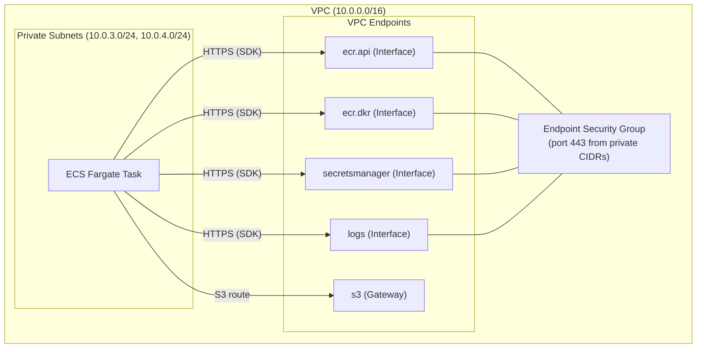

# Design Document: NAT Gateway to VPC Interface Endpoints

## Overview

This change replaces the `aws_nat_gateway` (and its associated `aws_eip`) in the Backstage portal's
VPC Terraform module with a set of VPC Endpoints that provide private connectivity from ECS Fargate
tasks to the AWS services they depend on: ECR, Secrets Manager, and CloudWatch Logs.

The motivation is purely cost: a NAT Gateway costs ~$35/month in fixed charges regardless of traffic.
The equivalent set of VPC Interface Endpoints costs ~$7/month, saving ~$28/month with no change to
application code or deployment topology.

### Design Goals

- ECS Fargate tasks remain in private subnets (no security regression).
- All AWS SDK calls from the application continue to work without code changes (private DNS handles resolution).
- The VPC module remains self-contained; no new inter-module dependencies are introduced.
- The `aws_region` variable makes the module portable across regions.

### Non-Goals

- Moving ECS tasks to public subnets (Option B in the cost doc) — rejected for security reasons.
- Adding endpoints for services not currently used by the application (e.g., STS, SSM).
- Changing the application's IAM permissions or task role.

---

## Architecture

### Before (NAT Gateway)

```
Private Subnet (ECS Task)
  └─► Private Route Table
        └─► 0.0.0.0/0 → NAT Gateway (EIP)
              └─► Internet Gateway → Public Internet → AWS Service APIs
```

### After (VPC Endpoints)

```
Private Subnet (ECS Task)
  ├─► Private Route Table
  │     └─► com.amazonaws.{region}.s3 → S3 Gateway Endpoint (free)
  │
  └─► Interface Endpoints (ENIs in private subnets, port 443)
        ├─► ecr.api      (image manifest / auth)
        ├─► ecr.dkr      (image layer pulls → resolves to S3 via Gateway EP)
        ├─► secretsmanager
        └─► logs         (CloudWatch Logs)
```

Private DNS is enabled on all Interface Endpoints, so the standard AWS SDK endpoint URLs
(e.g., `ecr.us-east-1.amazonaws.com`) resolve to the private ENI IPs inside the VPC.
No application code or environment variable changes are required.

### Mermaid Diagram



---

## Components and Interfaces

### terraform/modules/vpc/main.tf

The VPC module is the sole location of all network resource definitions. The changes are:

| Removed | Added |
|---|---|
| `aws_eip.nat` | `aws_security_group.vpc_endpoints` |
| `aws_nat_gateway.main` | `aws_vpc_endpoint.s3` (Gateway) |
| Default route `0.0.0.0/0` in private route table | `aws_vpc_endpoint.ecr_api` (Interface) |
| | `aws_vpc_endpoint.ecr_dkr` (Interface) |
| | `aws_vpc_endpoint.secretsmanager` (Interface) |
| | `aws_vpc_endpoint.logs` (Interface) |

All Interface Endpoints share the same security group and are attached to both private subnets.
The S3 Gateway Endpoint is associated with the private route table (not subnets).

### terraform/modules/vpc/variables.tf

One new variable is added:

```hcl
variable "aws_region" {
  description = "AWS region, used for VPC endpoint service names"
  type        = string
}
```

### terraform/main.tf (root module)

Passes `aws_region = var.aws_region` to the `module "vpc"` block. No other root-level changes.

### terraform/README_COSTS.md

Documents the before/after cost breakdown. Already created as part of this feature.

---

## Data Models

### VPC Endpoint Resource Schema

Each Interface Endpoint resource follows this pattern:

```hcl
resource "aws_vpc_endpoint" "<name>" {
  vpc_id              = aws_vpc.main.id
  service_name        = "com.amazonaws.${var.aws_region}.<service>"
  vpc_endpoint_type   = "Interface"
  subnet_ids          = aws_subnet.private[*].id
  security_group_ids  = [aws_security_group.vpc_endpoints.id]
  private_dns_enabled = true

  tags = merge(local.tags, { Name = "${var.project}-${var.environment}-vpce-<service>" })
}
```

The S3 Gateway Endpoint differs:

```hcl
resource "aws_vpc_endpoint" "s3" {
  vpc_id            = aws_vpc.main.id
  service_name      = "com.amazonaws.${var.aws_region}.s3"
  vpc_endpoint_type = "Gateway"
  route_table_ids   = [aws_route_table.private.id]

  tags = merge(local.tags, { Name = "${var.project}-${var.environment}-vpce-s3" })
}
```

### Endpoint Security Group Schema

```hcl
resource "aws_security_group" "vpc_endpoints" {
  name        = "${var.project}-${var.environment}-vpce-sg"
  description = "Allow HTTPS from private subnets to VPC endpoints"
  vpc_id      = aws_vpc.main.id

  ingress {
    from_port   = 443
    to_port     = 443
    protocol    = "tcp"
    cidr_blocks = var.private_subnet_cidrs   # ["10.0.3.0/24", "10.0.4.0/24"]
  }

  egress {
    from_port   = 0
    to_port     = 0
    protocol    = "-1"
    cidr_blocks = ["0.0.0.0/0"]
  }
}
```

### Service Name Construction

Service names are constructed at plan time using string interpolation:

| Endpoint | Service Name |
|---|---|
| ECR API | `com.amazonaws.${var.aws_region}.ecr.api` |
| ECR Docker | `com.amazonaws.${var.aws_region}.ecr.dkr` |
| Secrets Manager | `com.amazonaws.${var.aws_region}.secretsmanager` |
| CloudWatch Logs | `com.amazonaws.${var.aws_region}.logs` |
| S3 (Gateway) | `com.amazonaws.${var.aws_region}.s3` |

