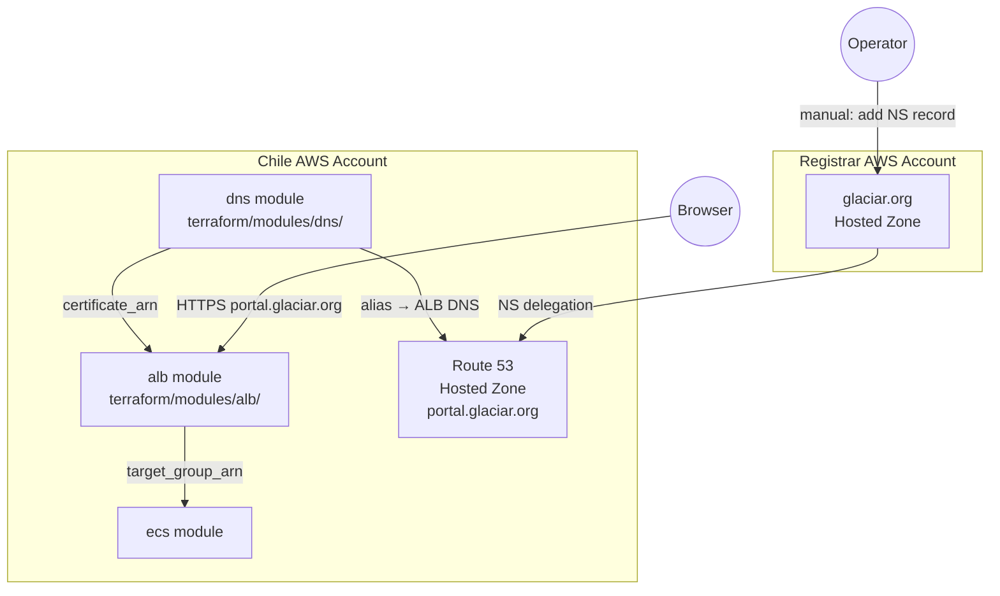

# Design Document: Route 53 Portal Domain (`06-route53-portal`)

## Overview

This feature wires a custom domain (`portal.glaciar.org`) to the existing Backstage ALB in the Chile AWS account using subdomain delegation. The approach avoids touching the registrar account during `terraform apply` — all AWS resources are created in the Chile account, and a single manual step (adding an NS record in the `glaciar.org` zone) is performed once by an operator after the first apply.

The work is entirely Terraform. No application code changes are required.

### Key design decisions

- **Subdomain delegation over cross-account Route 53**: Keeps all DNS management for `portal.glaciar.org` inside the Chile account. The registrar account only needs one NS record added once.
- **DNS validation over email validation**: ACM DNS validation integrates cleanly with Terraform — the CNAME records are created automatically in the same apply, and `aws_acm_certificate_validation` blocks until the cert reaches `ISSUED`.
- **New `dns` module**: Encapsulates the hosted zone, certificate, validation records, and alias record. The root module wires it to the existing `alb` module.
- **Remove `var.acm_certificate_arn` from root**: The cert ARN is now always produced by the `dns` module. The old root-level variable becomes unused and is removed.

---

## Architecture



### Apply sequence

1. `dns` module creates the Route 53 hosted zone.
2. `dns` module creates the ACM certificate (DNS validation method).
3. `dns` module creates the CNAME validation records in the hosted zone.
4. `aws_acm_certificate_validation` waits for the cert to reach `ISSUED` — this only succeeds after the operator adds the NS delegation record and DNS propagates.
5. `dns` module creates the A alias record pointing to the ALB.
6. Root module passes `module.dns.certificate_arn` to `module.alb.acm_certificate_arn`.
7. ALB module creates the HTTPS listener with the validated cert.

> **Note on first apply**: Steps 4–7 will time out until the NS delegation is in place. The recommended workflow is: run `terraform apply -target=module.dns.aws_route53_hosted_zone.main` first to get the nameservers, add the NS record in the registrar account, then run the full `terraform apply`.

---

## Components and Interfaces

### `terraform/modules/dns/`

New module. Owns all DNS and certificate resources.

**Input variables** (`variables.tf`):

| Variable | Type | Description |
|---|---|---|
| `domain_name` | `string` | FQDN for the portal subdomain (e.g. `portal.glaciar.org`) |
| `alb_dns_name` | `string` | DNS name of the ALB (from `module.alb.alb_dns_name`) |
| `alb_zone_id` | `string` | Canonical hosted zone ID of the ALB (from `module.alb.alb_zone_id`) |
| `environment` | `string` | Environment tag value |
| `project` | `string` | Project tag value |

Validation: `alb_dns_name` must be non-empty (enforced via `validation` block).

**Outputs** (`outputs.tf`):

| Output | Type | Description |
|---|---|---|
| `hosted_zone_id` | `string` | Route 53 hosted zone ID |
| `name_servers` | `list(string)` | NS records for the hosted zone |
| `certificate_arn` | `string` | ARN of the validated ACM certificate |

**Resources** (`main.tf`):

- `aws_route53_zone.main` — public hosted zone for `var.domain_name`
- `aws_acm_certificate.main` — certificate with `dns` validation method
- `aws_route53_record.cert_validation` — CNAME records from `aws_acm_certificate.main.domain_validation_options`
- `aws_acm_certificate_validation.main` — waits for `ISSUED` state
- `aws_route53_record.alias` — A alias record pointing to the ALB

### `terraform/main.tf` (root module changes)

- Add `module "dns"` block wiring `alb_dns_name` and `alb_zone_id` from `module.alb`.
- Change `module "alb"` to pass `acm_certificate_arn = module.dns.certificate_arn`.
- Change `module "ecs"` `app_base_url` to `"https://${var.domain_name}"`.
- Remove `var.acm_certificate_arn` from root (no longer needed).

### `terraform/variables.tf` (root changes)

- Add `var.domain_name` (`string`, default `"portal.glaciar.org"`).
- Remove `var.acm_certificate_arn`.

### `terraform/outputs.tf` (root changes)

- Add `output "portal_nameservers"` sourced from `module.dns.name_servers`.

---

## Data Models

There are no application-level data models. The relevant Terraform state objects are:

### Route 53 Hosted Zone

```hcl
resource "aws_route53_zone" "main" {
  name = var.domain_name          # "portal.glaciar.org"
  tags = {
    Environment = var.environment
    Project     = var.project
    Name        = "${var.project}-${var.environment}-hz"
  }
}
```

Output: `aws_route53_zone.main.name_servers` — list of 4 NS hostnames assigned by AWS.

### ACM Certificate

```hcl
resource "aws_acm_certificate" "main" {
  domain_name       = var.domain_name
  validation_method = "DNS"
  tags = {
    Environment = var.environment
    Project     = var.project
  }
  lifecycle {
    create_before_destroy = true
  }
}
```

### CNAME Validation Records

```hcl
resource "aws_route53_record" "cert_validation" {
  for_each = {
    for dvo in aws_acm_certificate.main.domain_validation_options : dvo.domain_name => {
      name   = dvo.resource_record_name
      type   = dvo.resource_record_type
      record = dvo.resource_record_value
    }
  }
  zone_id = aws_route53_zone.main.zone_id
  name    = each.value.name
  type    = each.value.type
  records = [each.value.record]
  ttl     = 60
}
```

### Certificate Validation Waiter

```hcl
resource "aws_acm_certificate_validation" "main" {
  certificate_arn         = aws_acm_certificate.main.arn
  validation_record_fqdns = [for r in aws_route53_record.cert_validation : r.fqdn]
}
```

Output: `aws_acm_certificate_validation.main.certificate_arn` — only resolves after cert is `ISSUED`.

### Alias Record

```hcl
resource "aws_route53_record" "alias" {
  zone_id = aws_route53_zone.main.zone_id
  name    = var.domain_name
  type    = "A"

  alias {
    name                   = var.alb_dns_name
    zone_id                = var.alb_zone_id
    evaluate_target_health = true
  }
}
```

### Variable validation

```hcl
variable "alb_dns_name" {
  type = string
  validation {
    condition     = length(var.alb_dns_name) > 0
    error_message = "alb_dns_name must not be empty."
  }
}
```


---

## Correctness Properties

*A property is a characteristic or behavior that should hold true across all valid executions of a system — essentially, a formal statement about what the system should do. Properties serve as the bridge between human-readable specifications and machine-verifiable correctness guarantees.*

### Property 1: Hosted zone tags reflect inputs

*For any* `project` and `environment` string values passed to the `dns` module, the resulting `aws_route53_zone` resource's tags must contain `Project = project` and `Environment = environment`.

**Validates: Requirements 1.3**

---

### Property 2: Alias record zone ID is the ALB zone ID

*For any* `alb_zone_id` value passed to the `dns` module, the `alias` block of the `aws_route53_record.alias` resource must use that exact value as its `zone_id` (not a hardcoded string).

**Validates: Requirements 3.3**

---

### Property 3: app_base_url uses HTTPS and the domain name

*For any* `domain_name` value set in the root module, the `app_base_url` argument passed to the `ecs` module must equal `"https://${domain_name}"`.

**Validates: Requirements 4.2**

---

### Property 4: Empty alb_dns_name is rejected

*For any* call to the `dns` module where `alb_dns_name` is an empty string, Terraform validation must produce an error and refuse to create the alias record.

**Validates: Requirements 6.4**

---

## Error Handling

### Certificate validation timeout

`aws_acm_certificate_validation` will block indefinitely if the NS delegation record is never added. Mitigation: document the two-phase apply workflow (target the hosted zone first, output nameservers, add NS delegation, then full apply). Default Terraform timeout for this resource is 75 minutes.

### NS delegation propagation delay

DNS propagation after adding the NS record can take minutes to hours. The `aws_acm_certificate_validation` resource will retry until the cert is issued or the timeout is reached. No special handling needed in Terraform — operators should be aware of the delay.

### Removing `var.acm_certificate_arn` from root

The existing root variable `acm_certificate_arn` must be removed. If it was set in a `terraform.tfvars` or CI environment variable, that value must be removed before apply to avoid an "unknown variable" error.

### `create_before_destroy` on ACM certificate

The certificate resource uses `lifecycle { create_before_destroy = true }` to prevent downtime if the cert needs to be replaced (e.g. domain name change). The old cert is only destroyed after the new one is attached to the listener.

### ALB module backward compatibility

The `alb` module's `acm_certificate_arn` variable already has `default = ""`, so existing deployments without the `dns` module are unaffected. The root module now always passes the value from `module.dns.certificate_arn`.

---

## Testing Strategy

### Unit / example tests (Terraform)

Use `terraform validate` and `terraform plan` in CI to catch structural issues. The following specific examples should be verified:

- `terraform/modules/dns/` contains `main.tf`, `variables.tf`, `outputs.tf` (Req 6.1)
- `dns` module declares all five required input variables (Req 6.2)
- `dns` module exposes `hosted_zone_id`, `name_servers`, `certificate_arn` outputs (Req 6.3)
- Root module declares `var.domain_name` with `default = "portal.glaciar.org"` (Req 4.3)
- Root `outputs.tf` declares `portal_nameservers` with a description (Req 5.2)
- `module.alb.acm_certificate_arn` is wired to `module.dns.certificate_arn` in root (Req 4.1)
- ACM certificate uses `validation_method = "DNS"` (Req 2.1)
- `aws_acm_certificate_validation` resource exists in the `dns` module (Req 2.3)
- `certificate_arn` output is sourced from `aws_acm_certificate_validation` (not raw cert) (Req 2.4)
- Alias record is type `A` with an `alias` block (Req 3.1)

### Property-based tests

Use [Terratest](https://terratest.gruntwork.io/) (Go) as the property-based testing library. Each property test runs the module with randomized inputs (minimum 100 iterations via table-driven tests or fuzzing).

**Property 1 test** — `Feature: 06-route53-portal, Property 1: Hosted zone tags reflect inputs`
Generate random `project` and `environment` strings. Run `terraform plan` on the `dns` module. Assert the planned `aws_route53_zone` tags contain the generated values.

**Property 2 test** — `Feature: 06-route53-portal, Property 2: Alias record zone ID is the ALB zone ID`
Generate random `alb_zone_id` strings. Run `terraform plan`. Assert the `alias.zone_id` in the planned `aws_route53_record.alias` equals the input value.

**Property 3 test** — `Feature: 06-route53-portal, Property 3: app_base_url uses HTTPS and the domain name`
Generate random `domain_name` strings. Run `terraform plan` on the root module. Assert `module.ecs.app_base_url` in the plan equals `"https://${domain_name}"`.

**Property 4 test** — `Feature: 06-route53-portal, Property 4: Empty alb_dns_name is rejected`
Pass `alb_dns_name = ""` to the `dns` module. Run `terraform validate`. Assert the command exits with a non-zero status and the error message references `alb_dns_name`.

### Integration / smoke test

After a full apply in a sandbox account with NS delegation in place:
- `dig portal.glaciar.org` resolves to the ALB IP.
- `curl -I https://portal.glaciar.org` returns HTTP 200 or 302 with a valid TLS certificate.
- `terraform output portal_nameservers` returns a list of 4 NS hostnames.
