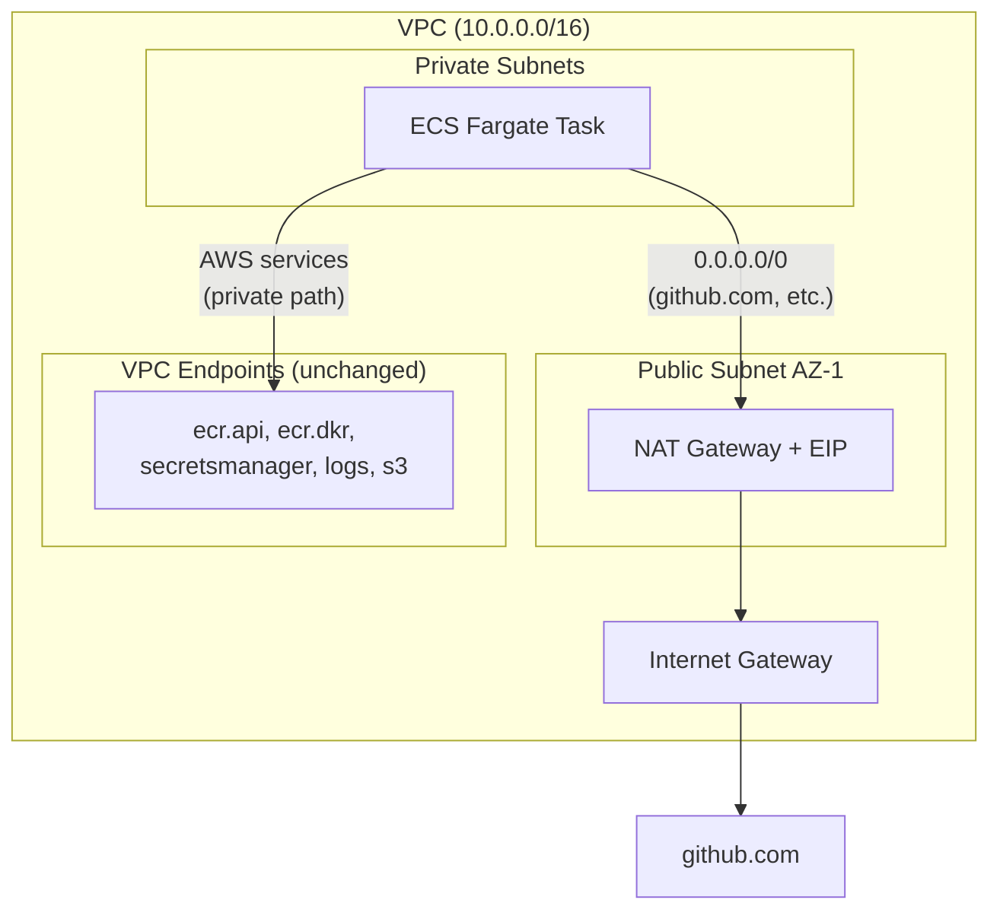

# Design Document: Single-AZ NAT Gateway for Outbound Internet (`07-single-az-nat`)

## Overview

This change adds back a NAT Gateway in a single Availability Zone to restore outbound internet
access for ECS Fargate tasks in private subnets. The existing VPC endpoints for AWS services
remain in place, so AWS traffic stays on private paths and avoids NAT data processing charges.

### Context

Spec `05-nat-to-endpoints` removed the NAT Gateway to save ~$28/month, replacing it with VPC
endpoints for ECR, Secrets Manager, CloudWatch Logs, and S3. This worked for all AWS SDK calls
but broke GitHub OAuth authentication: the Backstage backend needs to call
`https://github.com/login/oauth/access_token` to exchange the authorization code for a token,
and this external HTTPS call fails with no route to the internet.

### Design Goals

- Restore outbound internet access for ECS tasks at minimal cost (~$16/month).
- Keep existing VPC endpoints so AWS service traffic avoids NAT Gateway data processing fees.
- Single-AZ only — acceptable for an MVP/sandbox, avoids doubling the NAT cost.
- No application code changes required.

### Non-Goals

- Multi-AZ NAT Gateway redundancy (not needed for MVP/sandbox).
- Removing VPC endpoints (they save on data processing costs and reduce NAT traffic).

---

## Architecture

### After (Single-AZ NAT + VPC Endpoints)

```
Private Subnet (ECS Task)
  ├── AWS service traffic → VPC Endpoints (ECR, SM, Logs, S3)
  │     (same as before — no change)
  │
  └── External traffic (github.com, npm, etc.)
        └── Private Route Table: 0.0.0.0/0 → NAT Gateway (AZ-1)
              └── Internet Gateway → Public Internet
```

### Mermaid Diagram



### Traffic flow

| Destination | Route | Path |
|---|---|---|
| ECR, Secrets Manager, Logs | VPC Endpoint (private DNS) | ECS → ENI in private subnet |
| S3 | Gateway Endpoint (route table) | ECS → S3 prefix list route |
| github.com, npm, external | `0.0.0.0/0` → NAT Gateway | ECS → NAT (public subnet) → IGW → Internet |

VPC endpoint routes take precedence over the default route, so AWS service traffic never hits the NAT Gateway.

---

## Components and Interfaces

### `terraform/modules/vpc/main.tf`

Add three resources:

```hcl
resource "aws_eip" "nat" {
  domain = "vpc"
  tags   = merge(local.tags, { Name = "${var.project}-${var.environment}-nat-eip" })
}

resource "aws_nat_gateway" "main" {
  allocation_id = aws_eip.nat.id
  subnet_id     = aws_subnet.public[0].id   # Single AZ — first public subnet

  tags = merge(local.tags, { Name = "${var.project}-${var.environment}-nat" })

  depends_on = [aws_internet_gateway.main]
}
```

Add default route to existing private route table:

```hcl
resource "aws_route" "private_nat" {
  route_table_id         = aws_route_table.private.id
  destination_cidr_block = "0.0.0.0/0"
  nat_gateway_id         = aws_nat_gateway.main.id
}
```

### No changes to

- VPC Endpoint resources (all five remain)
- Endpoint Security Group
- Public route table
- Subnet definitions
- Any other modules (alb, ecs, rds, secrets, dns, oidc)

---

## Cost Impact

| Resource | Before (05) | After (07) |
|---|---|---|
| NAT Gateway (1 AZ) | $0 | ~$16/month |
| VPC Interface Endpoints (4x) | ~$7/month | ~$7/month |
| S3 Gateway Endpoint | Free | Free |
| **Total networking** | **~$7/month** | **~$23/month** |

Still ~$12/month cheaper than the original dual-AZ NAT Gateway setup (~$35/month).

---

## Error Handling

### NAT Gateway in single AZ

If the AZ hosting the NAT Gateway goes down, outbound internet traffic from both private subnets
will fail. AWS service traffic via VPC endpoints is unaffected (endpoints are in both AZs).
This is acceptable for an MVP/sandbox. For production, add a second NAT Gateway in AZ-2.

### EIP release on destroy

The `aws_eip` is released when `terraform destroy` runs. No manual cleanup needed.

---

## Testing Strategy

### Smoke test after apply

1. Force a new ECS deployment: `aws ecs update-service --force-new-deployment`
2. Wait for the task to reach RUNNING state.
3. Open `https://backstage.glaciar.org` in a browser.
4. Click "Sign in using GitHub".
5. Verify the popup navigates to GitHub, completes authorization, and returns a valid session.
6. Check ECS logs for any network errors.

### Terraform plan verification

1. `terraform plan` shows exactly 3 new resources: `aws_eip.nat`, `aws_nat_gateway.main`, `aws_route.private_nat`.
2. No changes to existing VPC endpoints, security groups, or subnets.
